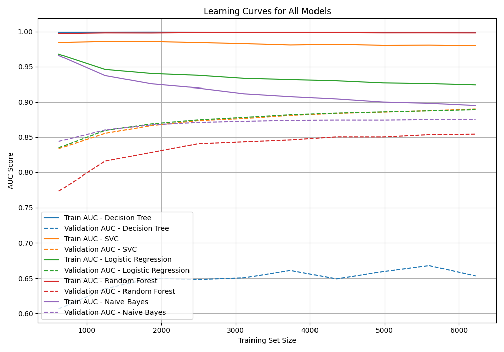

# Miners Sequel
# Sentiment Analysis using Steam Reviews
## Team Members: Nilay, Mariia, Vasco, Sindhuj
## Problem Statement
Steam hosts millions of user reviews in various languages, shaping both game visibility and perceived quality. However, the unstructured nature of this data presents challenges for systematically evaluating user sentiment.

Our project aims to:

1. Build and evaluate sentiment classification models to determine whether a review expresses positive or negative sentiment.

2. Compare traditional rule-based approaches (e.g., VADER) with modern embedding-based models (e.g., Sentence Transformers).

3. Assess multilingual model performance, focusing on scalability to languages beyond English, starting with Spanish.

4. Identify the most accurate and scalable approach for sentiment analysis across languages and platforms.

5. Optimize model parameters and dataset choices for each technique.

6. Test model robustness by introducing non-gaming data to evaluate domain sensitivity of embedding-based models.

## Data Sources 
We used the [Steam API](https://partner.steamgames.com/doc/store/getreviews) to scrape game reviews directly from the gaming website. To manage the balance of upvotes and ensure that we have a sizeable amount of reviews, we choose our games specifically. Specifically, these games had, at least, more than 10,000 recent reviews. The following table shows the games considered.

| Game Name (App Id)                   | Review Score | Review Rating        | Category             | 
|------------------------------|--------------|----------------------|----------------------| 
| Schedule I (3164500)                     | 97%          | Extremely Positive                | Crime               |
| Balatro (2379780)      | 96%          | Extremely Positive             | Cards/Poker           | 
| WEBFISHING (3146520)      | 96%          | Extremely Positive             | Fishing, Multi Player | 
| NBA 2K20 (1089350)                     | 50%          | Mixed                | Sports               |
| Kerbal Space Program 2 (954850)      | 30%          | Negative             | Simulation           | 
| Monster Hunter Wilds (2246340)      | 59%          | Mixed                | Action, Multi Player | 
| Cube World (1128000)                | 37%          | Mostly Negative   | Open World   | 
| Terraria (105600)                    | 97%          | Extremely Positive   | Sandbox, Survival    | 
| Portal 2 (620)                     | 98%          | Extremely Positive   | Puzzle, Adventure    | 
| The Crew 2 (646910)                    | 74%          | Positive             | Driving            |
| Star Wars: Battlefront Classic Collection (2446550)| 23% | Extremely Negative| Space FPS            |
| Mafia III: Definitive Edition (360430)| 57%          | Mixed                | Action, Open World   | 
| Resident Evil Resistance (952070)                | 38%          | Negative             | Horror, Multiplayer    | 
| Wolcen: Lords of Mayhem (424370)      | 55%          | Mixed                | Action, RPG          | 
| Cities: Skylines II (949230)         | 52%          | Mixed                | City Builder         | 
| Tekken 8 (1778820)                    | 54%          | Mixed                | Fighting             | 
| EA SPORTS™ FIFA 23 (1811260)          | 57%          | Mixed                | Sports               | 
| Call of Duty® (1938090)      | 59%          | Mixed                | FPS, Multiplayer     | 
| Fall Guys (1097150)      | 81%          | Positive                | Battle Royale, Multiplayer     | 

Our combined dataset consisted of the following columns/features:
* **Recommendation ID**: a unique identifier for each review.
* **Language**: the language in which the review was written.
* **Voted up**: indicator for positive reviews.
* **App ID**: the unique identifier for each game.
* **Review**: the raw text of each review.

## Data Cleaning and Preprocessing
Initially, when we attempted to scrape reviews, we noticed that the API had some issues when calling for a new set of reviews. Multiple times, the API returned duplicate reviews. To address this problem, we exploited the fact that the API call could filter across different parameters, like only positive or negative reviews, review recency, by ownership of the game, etc. Iterating over all the possible parameter combinations, we were able to collect at least 500 reviews for each game and compile a little more than 9000 unique reviews in English. We followed the same procedure for Spanish reviews and compiled more than 7000 unique reviews. 

The final English dataset was perfectly balanced. However, the Spanish dataset was initially unbalanced, so we had to create a balanced file by randomly sampling an equal number of positive and negative reviews.

## Limitations
* Some reviews do not consider correct sentence structure. For instance, a review could just contain emojis or single-word responses like trash, legendary, perfect, etc. So certain classifiers that consider context and the placement of words within a sentence could notice inaccuracies or be unusable altogether.
* Certain terminology may be unique to specific games. As a result, several words may be associated with the value of that specific game rather than general sentiments.
* Reviews with nuance in them may not be completely representative of the "upvote" indicator. For instance, when someone uses "I liked this game but...", it could contain information valuable to both positive and negative predictions.
* Given that upvotes are binary, users can't express their degree of positive/negative opinion. 
* Reviews can be used to increase a user's account level on Steam. Because of such instances, certain reviews are not genuine/are rushed.

## 1. Basic Sentiment Classifier

### 1.1 Benchmarks
* AUC
* Precision
* Recall
* ROC curve
* Learning curve (rate of learning depending on how much data we feed the model)

### 1.2 Methodology

We used TF-IDF vectorization to convert text reviews into numerical features suitable for machine learning, and applied a stratified train-test split to preserve class balance. Our analysis evaluated six models:

* Logistic Regression
* Naive Bayes
* Random Forest
* Decision Tree
* Support Vector Classification (SVC)
* VADER (a rule-based sentiment analyzer working directly on raw text without TF-IDF, threshold optimization)
* Each model was assessed using AUC, precision, and recall.

### 1.3 Main Findings
* **ROC curves**:
* 
* **Learning curves**:
* 

| Model                          | Precision | Recall |
|-------------------------------|-----------|--------|
| Logistic Regression           | 0.83      | 0.85   |
| Naive Bayes                   | 0.82      | 0.85   |
| Random Forest                 | 0.77      | 0.80   |
| Decision Tree                 | 0.66      | 0.70   |
| Support Vector Classification (SVC) | 0.83      | 0.85   |
| VADER                         | 0.81      | 0.90   |

* **Best Performing**: Logistic Regression and SVC
* 
* **Underperforming**: Decision Tree and VADER
* 

### 1.4 Model limitations

* **Decision Tree & Random Fores**t: As tree-based algorithms, both models are prone to overfitting, particularly on noisy or high-dimensional data such as TF-IDF features.
* **Logistic Regression**: Works well for simple patterns, but can miss sarcasm or complex sentiment that doesn’t follow a straight line.
* **Naive Bayes**: Assumes word independence so gets problems with phrases like “not good.”
* **SVC**: Takes longer to train and uses more memory—especially when dealing with lots of reviews.
* **VADER**: Rule-based and cannot learn from context or domain-specific language (e.g., gaming slang or sarcasm). Struggles with negation, and sarcasm, and lacks context awareness.

### 1.5 Extensions

* Instead of relying on TF-IDF, we could use modern language models (like BERT) that understand the context of words (capture sarcasm, tone, and subtle meaning in reviews).
* Rather than just labeling reviews as positive or negative, we could expand the analysis to identify emotions like joy, anger, or frustration for deeper insights.
* VADER's sentiment score could be added as a feature in machine learning models, blending human-coded rules with data-driven learning
## 2. Embedding 

### 2.1 Benchmarks
* AUC
* Average Precision
* ROC curve
* Learning curve (rate of learning depending on how much data we feed the model)

### 2.2 Methodology
To expand our analysis from the earlier models, we tried to use the data to create embeddings based on Sentence Bidirectional Encoder Representations from Transformers (SBERT). We chose these embedding models as they consider each word within the context of its position in a sentence. We use the following versions of the model:
1. all-MiniLM-L6-v2: This is a relatively fast model that can be used as a baseline for embedding text in the English language.
2. paraphrase-Multilingual-MiniLM-L12-v2: This is a longer, multilingual model used in this context for English and Spanish.

After embedding, we made predictions using Logistic Regression, as this was the best/most consistent classifier for our dataset. To optimize the classifier, we fine-tuned the parameters C (inverse of regularization strength), the penalty size, and the solver type. We finally consider the area under the curve (AUC) as 'scoring' when finding our best model using GridsearchCV.

### 2.3 Main Findings
After running both types of models, we noticed the following performance across the benchmarks:

| Metric             | MiniLM-English                                | MiniLM-Multilingual (EN)                    | MiniLM-Multilingual (ES)                    |
|--------------------|-----------------------------------------------|---------------------------------------------|---------------------------------------------|
| AUC                | 0.8861                                        | 0.8890                                      | 0.8712                                      |
| Average Precision  | 0.8999                                        | 0.8997                                      | 0.8721                                      |
| Best Parameters    | {'C': 1, 'penalty': 'l2', 'solver': 'liblinear'} | {'C': 0.1, 'penalty': 'l2', 'solver': 'liblinear'} | {'C': 0.1, 'penalty': 'l2', 'solver': 'liblinear'} |

The next plot shows the ROC curve:

### 2.4 Robustness checks
| Model                          | Precision | Recall | AUC |
|-------------------------------|-----------|--------|--------|
| Logistic Regression           | 0.78      | 0.83   | 0.82 |
| Naive Bayes                   | 0.81      | 0.89   | 0.79 |
| Random Forest                 | 0.73      | 0.75   | 0.79 |
| Decision Tree                 | 0.59      | 0.62   | 0.58 |
| Support Vector Classification (SVC) | 0.81      | 0.87   | 0.82|
| VADER                         | 0.79      | 0.86   | 0.78 |
#### i. Performance across other data (movie reviews)
We downloaded a dataset from Hugging Face that lists movie reviews with sentiments from IMDb. We trained the model using the English data from the Steam reviews and tested it on the IMDb dataset. We noticed the following performance across the benchmarks:
| Evaluation Setting                      | AUC    | Average Precision | Best Logistic Regression Params                     |
|----------------------------------------|--------|-------------------|-----------------------------------------------------|
| Train: Steam Test: IMDB             | 0.8168 | 0.8200            | {'C': 0.1, 'penalty': 'l2', 'solver': 'liblinear'}  |
| Train: EN (Steam) Test: ES (Steam)  | 0.8726 | 0.8701            | {'C': 0.1, 'penalty': 'l2', 'solver': 'lbfgs'}      |
| Train: ES (Steam) Test: EN (Steam)  | 0.8743 | 0.8702            | {'C': 1, 'penalty': 'l2', 'solver': 'liblinear'}    |

#### ii. Performance across training set size.
To test how our model's performance changes with training group size, we plot these benchmarks for a fixed test size (500 observations) across increasing training sizes. All training samples are randomly selected and stratified to maintain balance in observations. 
Here's how our benchmarks changed with increasing training set size:

For both models, increasing the training set size only slightly improves the performance. Additionally, we see performance across all benchmarks plateau at a training set size of around 2200.
#### iii. Performance across sample sizes.
To test the minimum amount of equally split sample data we need to optimize our model's performance, we plot the benchmarks across increasing sample sizes.
Here's how our benchmarks changed with increasing sample size:

For both models, increasing the sample size only slightly improves the performance. Additionally, we see performance across all benchmarks plateau at a sample size of around 1500.

### 2.4 Model limitations
* While these models still perform well, they don't perform as well as the TF-IDF-based model. This implies that converting sentences into dense semantic embeddings doesn't have a lot of value.
* This dataset is ideal for most types of models, and training on this dataset also extends predictions to other datasets. So the actual strength/robustness of our models can be difficult to discern.

## Conclusion
* We were considerably successful at predicting user sentiments (AUC > 0.85 across all models), even for reviews that were not related to video games and for reviews in other languages.
* For sentiment analysis, the TF-IDF vectorizer is a more scalable approach over platforms. Sbert models are useful only in cases where multiple languages are being considered.
* Among all the classifier options, logistic regression performed consistently well for all types of word/sentence processors.

## Extensions
* Instead of a binary upvote option, look for a dataset with a scale of sentiment options (Ex, 1-10).
* Add features like hours played, game genre, review length, or user reputation to see if these improve classification performance.
* Perform a detailed analysis of misclassified examples to understand model blind spots.
* Instead of using the dataset to classify sentiment in positive and negative reviews, we can use Latent Dirichlet Allocation (LDA) or BERTopic for topic-level modelling.
